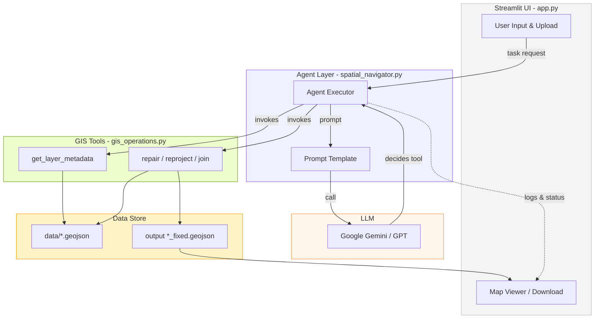

# GeoAgent Starter 🗺️

An AI-powered geospatial agent that leverages LangChain and Google Gemini to automate GIS workflows. This agent intelligently handles CRS reprojection, geometry repairs, spatial joins, and metadata analysis without manual intervention.

## Features ✨

- **Intelligent CRS Management**: Automatically detects and reprojects geospatial data to target coordinate systems
- **Geometry Repair**: Fixes topological errors including self-intersecting polygons and unclosed rings
- **Spatial Joins**: Performs spatial intersections between multiple layers with automatic CRS alignment
- **Metadata Analysis**: Extracts and reports CRS, bounds, columns, and geometry types from GIS files
- **AI-Powered Decisions**: Uses Google Gemini 2.0 Flash to understand natural language GIS tasks and select appropriate tools
- **Flexible Interface**: Use via Python API, Streamlit web UI, or direct agent invocation

## Quick Start 🚀

### Prerequisites
- Python 3.14+
- Google Gemini API key (set as `OPENAI_API_KEY` environment variable, or hardcoded in `agents/spatial_navigator.py`)
- GDAL/GEOS libraries (installed via geopandas)

### Installation

1. **Clone and navigate to the project:**
   ```bash
   cd d:\AI Projects\agenticforgis\geoagent-starter
   ```

2. **Create virtual environment (optional but recommended):**
   ```bash
   python -m venv .venv
   .venv\Scripts\activate
   ```

3. **Install dependencies:**
   ```bash
   pip install -r requirements.txt
   ```

## Usage 📚

### Option 1: Python Script (main.py)

Run the agent executor directly:
```bash
python main.py
```

Example in code:
```python
from agents.spatial_navigator import agent_executor

response = agent_executor.invoke({
    "messages": [("user", "Check the CRS of data/new_meter_readings.geojson")]
})

print(response["messages"][-1].content)
```

### Option 2: Streamlit Web Interface (Built-in)

```bash
streamlit run app.py
```

Provides the built-in Streamlit UI (`app.py`) for uploading GeoJSON files, running repair/reprojection tasks, and downloading results.

### Option 3: Direct Tool Usage

```python
from tools.gis_operations import get_layer_metadata, reproject, repair, repair_and_join

# Get file metadata
metadata = get_layer_metadata("./data/test_web_mercator.geojson")
print(metadata)

# Reproject to WGS84
reproject("./data/test_web_mercator.geojson", "EPSG:4326")

# Repair invalid geometries and reproject
repair("./data/test_invalid_self_intersect.geojson", "EPSG:4326")

# Join two layers with automatic CRS alignment
repair_and_join("./data/clean_hydrant_points.geojson", "./data/new_meter_readings.geojson")
```

## Available Tools 🛠️

### `get_layer_metadata(file_path: str)`
Returns CRS, bounds, columns, and geometry types of a GIS file.

**Example:**
```python
get_layer_metadata("./data/clean_hydrant_points.geojson")
# Output: "CRS: EPSG:4326 | Columns: ['id', 'status', 'last_inspected'] | Geometry: ['Point']"
```

### `reproject(source_path: str, tgt_crs: str = "EPSG:4326")`
Reprojects a layer to a target CRS.

**Example:**
```python
reproject("./data/test_web_mercator.geojson", "EPSG:4326")
# Creates: test_web_mercator_fixed.geojson
```

### `repair(file_path: str, target_crs: str = "EPSG:4326")`
Repairs invalid geometries (self-intersections, unclosed rings) and reprojects to target CRS.

**Example:**
```python
repair("./data/test_invalid_self_intersect.geojson", "EPSG:4326")
# Output: "Repaired 1 invalid geometries. Re-projected from EPSG:4326 to EPSG:4326..."
```

### `repair_and_join(source_path: str, target_path: str)`
Joins two layers with automatic CRS alignment.

**Example:**
```python
repair_and_join("./data/test_valid_wgs84.geojson", "./data/clean_hydrant_points.geojson")
# Output: "Join successful. Resulting rows: 3"
```

## Test Data 📂

Sample GeoJSON files are provided in the `data/` directory:

| File | Scenario | CRS |
|------|----------|-----|
| `test_valid_wgs84.geojson` | Valid points, no repairs needed | EPSG:4326 |
| `test_web_mercator.geojson` | Valid points requiring reprojection | EPSG:3857 |
| `test_invalid_self_intersect.geojson` | Self-intersecting polygon | EPSG:4326 |
| `test_unclosed_rings.geojson` | Polygon with unclosed ring | EPSG:4326 |
| `test_utm_zone.geojson` | Points in UTM Zone 10N | EPSG:26910 |
| `clean_hydrant_points.geojson` | Fire hydrant locations | EPSG:4326 |
| `new_meter_readings.geojson` | Water meter installs | EPSG:3857 |

## Project Structure 📁

```
geoagent-starter/
├── app.py                           # Streamlit web interface (built-in)
├── main.py                          # Entry point for agent executor
├── requirements.txt                 # Python dependencies
├── README.md                        # This file
├── agents/
│   └── spatial_navigator.py         # Agent configuration & LLM setup
├── tools/
│   └── gis_operations.py            # GIS tool definitions
└── data/
   ├── test_valid_wgs84.geojson
   ├── test_web_mercator.geojson
   ├── test_invalid_self_intersect.geojson
   ├── test_unclosed_rings.geojson
   ├── test_utm_zone.geojson
   ├── clean_hydrant_points.geojson
   └── new_meter_readings.geojson
```

## Architecture Diagram 🏗️

The diagram below shows the main components and the data flow between the Streamlit UI, the agent, the LLM, and the GIS toolset.



**Legend:** UI = user interaction; Agent = LangChain runtime that orchestrates tool calls; LLM = language model (Gemini/GPT); Tools = geoprocessing functions; Data = input/output GeoJSON files.
## Configuration ⚙️

### Environment Variables
Create a `.env` file or set in your shell:
```bash
OPENAI_API_KEY=your-google-gemini-api-key
```

### LLM Model
Default: `gemini-2.0-flash` (Google Generative AI)

To switch to OpenAI GPT-4, uncomment in `agents/spatial_navigator.py`:
```python
# llm = ChatOpenAI(model="gpt-4o", temperature=0, api_key=os.getenv("OPENAI_API_KEY"))
```

## Dependencies 📦

**Core Geospatial:**
- geopandas ≥1.0.1
- shapely ≥2.0.6
- pyogrio ≥0.10.0
- pyproj ≥3.7.0
- rtree ≥1.3.0

**AI & Agents:**
- langchain ≥0.3.0
- langchain-openai ≥0.2.0
- langchain-community ≥0.3.0
- langchain_google_genai

**Frontend:**
- streamlit ≥1.40.0
- leafmap ≥0.39.0
- folium ≥0.17.0

**Utilities:**
- python-dotenv ≥1.0.1
- pandas ≥2.2.3

## Known Limitations ⚠️

- Pydantic V1 compatibility warnings with Python 3.14+ (functional but logged)
- Large files (>100MB) may require increased memory
- Some uncommon CRS codes may not resolve; use EPSG codes when possible
- Self-intersecting geometry repair uses Shapely's `make_valid()` which may alter geometry topology

## Troubleshooting 🔧

### "contents are required" Error
Ensure `PromptTemplate` is properly initialized with all required placeholders (`{input}`, `{agent_scratchpad}`)

### CRS Not Recognized
Use EPSG codes (e.g., `EPSG:4326` instead of descriptive names)

### Import Errors for geopandas/pyogrio
Install GDAL/GEOS system libraries:
```bash
# Windows (via conda):
conda install -c conda-forge gdal geos

# macOS:
brew install gdal geos

# Linux (Ubuntu/Debian):
sudo apt-get install gdal-bin libgdal-dev libgeos-dev
```

## Future Enhancements 🎯

- [x] Web UI via Streamlit with file upload
- [ ] Multi-layer batch processing
- [ ] Support for additional geometry types (e.g., 3D)
- [ ] GeoJSON validation & fix recommendations
- [ ] Interactive map visualization
- [ ] Export to multiple formats (GeoPackage, Shapefile, KML)

## License 📄

MIT License - Feel free to use and modify!

## Contributing 🤝

Contributions welcome! Please submit issues and pull requests.

---

**Built with LangChain + Google Gemini 2.0 Flash** 🚀
